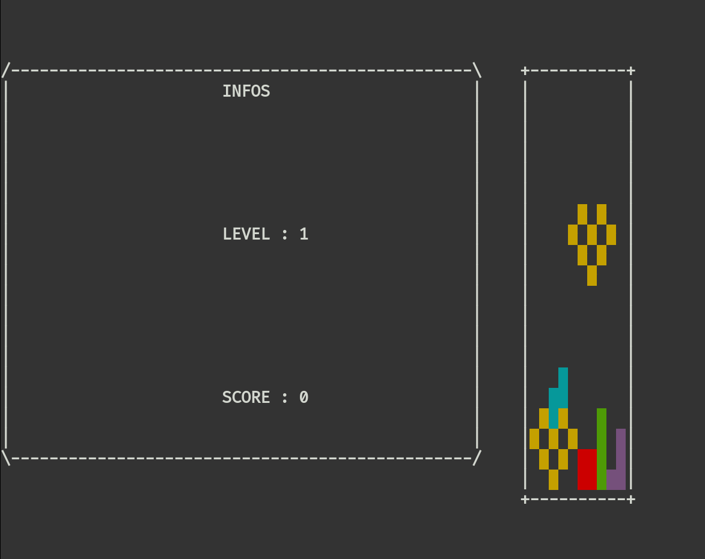

# Tetris

>The goal of this project is to recreate the Tetris game in a UNIX terminal, with the Gameboy version rules.
You have to use ncurses.

##Preview
<p align="center">
  
</p>


## Requirements

### Ncurses library

the [installation guide](https://invisible-island.net/ncurses/)

To install ncurses library please refer to
## Build and run

Linux:

```sh
make
./tetris
```
Usage:
```shell
./tetris --help
Usage: ./tetris [options]
Options:
--help Display this help
-L --level={num} Start Tetris at level num (def: 1)
-l --key-left={K} Move the tetrimino LEFT using the K key (def: left arrow)
-r --key-right={K} Move the tetrimino RIGHT using the K key (def: right arrow)
-t --key-turn={K} TURN the tetrimino clockwise 90d using the K key (def: top
arrow)
-d --key-drop={K} DROP the tetrimino using the K key (def: down arrow)
-q --key-quit={K} QUIT the game using the K key (def: ‘q’ key)
-p --key-pause={K} PAUSE/RESTART the game using the K key (def: space bar)
--map-size={row,col} Set the numbers of rows and columns of the map (def: 20,10)
-w --without-next Hide next tetrimino (def: false)
-D --debug Debug mode (def: false)
```

Tetriminos shapes are in `tetriminos` folder.
Example:
```
2 3 6
 *
**
*
```
2 = width

3 = height

6 = color
## Contributors
- Clément Ruat  [![github-link][github-logo]](https://github.com/fantoruse)

- Antoine Desruet [![github-link][github-logo]](https://github.com/antwxne)

<!-- Markdown link & img definition's -->

[vsc-installation-doc]: https://code.visualstudio.com/docs/editor/command-line

[cmake-installation-doc]: https://cmake.org/install/

[Github-logo]: https://img.shields.io/badge/GitHub-100000?style=for-the-badge&logo=github&logoColor=white
